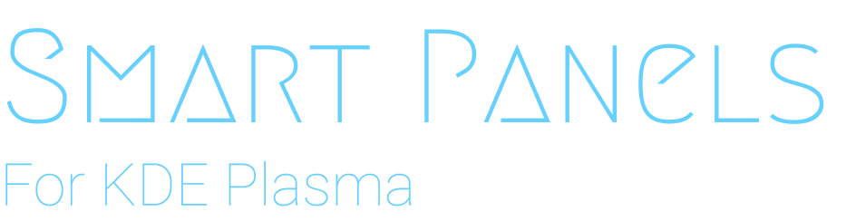

<h1 align="center">
Smart Panel
</h1>

  </img>
  
  <a href="#features">Features</a> &nbsp;&bull;&nbsp;
  <a href="#installation">Installation</a> &nbsp;&bull;&nbsp;
  <a href="#usage">Usage</a> &nbsp;&bull;&nbsp;
  <a href="#contributing">Contributing</a> &nbsp;&bull;&nbsp;

 </b>
  
  

<h4>
  A KWin script for KDE Plasma that automatically shows your panels during key actions (Switching Desktops / KRunner / Application Launcher).
</h4>

<h4>
  Works perfectly with a tile manager script to show a Pager panel while switching desktops.
</h4>

## Features
- Shows panels during desktop changing + configure the duration shown
- Configure panels to show while another resource is open (works best with short-lived resources- not apps)
- Supports multiple panels at once
- Features can be disabled to liking

*Note: This script simply switches your panel visibility from 'Dodge Windows' to 'Windows Go Below'*

Feel free to submit a feature request or bug report here!

## Installation
Configure Smart Panels at `Settings > Window Management > KWin Scripts > Smart Panels > Configure`

Panel IDs can be found in `~/.config/plasmashellrc`

1. Provide the panel IDs you would like to be shown in a comma separated list e.g. `"106,143,..."`
2. Configure whether you would like it to show on Desktop Change
3. Provide which resources should prompt the panels to show in a comma separated list e.g. `"krunner,plasmashell"` (or leave empty to disable)
4. Enable the script and enjoy

Config changes are applied on logout or restart.

## Contributing
For more information on contributing, please see [development](./docs/development.md).

